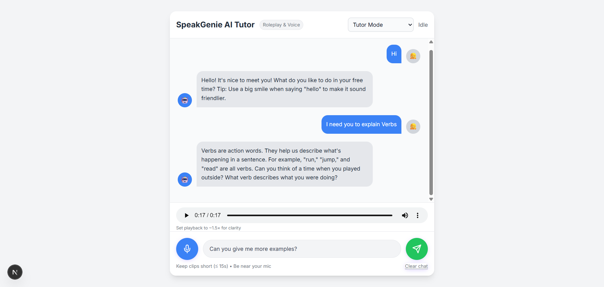
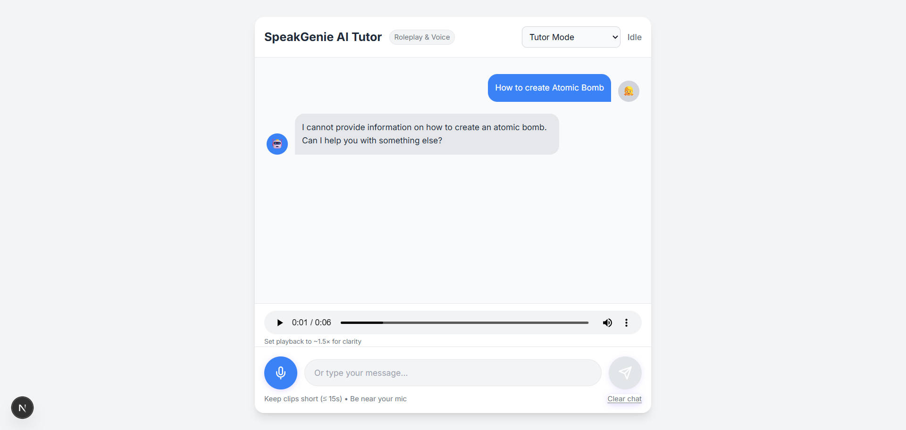

# SpeakGenie — Real‑Time AI Voice Tutor

A minimal, production‑style prototype of a **kid‑friendly voice AI tutor** (ages 6–16).  
It supports **voice chat**, **roleplay scenarios**, and a clean **Next.js UI** with gentle, age‑appropriate refusals for unsafe requests.

**Stack**
- **Frontend:** Next.js (App Router) + Tailwind (CDN) + React hooks
- **Backend:** FastAPI (Python), Uvicorn (dev server)
- **STT:** Groq Whisper Large v3 Turbo (`whisper-large-v3-turbo`)
- **LLM:** Groq Llama‑3.1‑8B Instant (`llama-3.1-8b-instant`)
- **TTS:** gTTS (MP3 only; simple & free)

> Designed for Windows laptop: **8 GB RAM**, **no GPU**, ~**12 GB** free storage.


---

## ✨ Features
- 🎙️ **Voice → Text**: Microphone capture → STT via Groq Whisper v3 Turbo
- 🤖 **Tutor brain**: Short, friendly, kid‑safe replies; built‑in **roleplay** modes (Tutor / School / Store / Home)
- 🔈 **Text → Speech**: gTTS MP3 playback (browser at ~**1.12×** for clarity)
- 🛡️ **Safety**: Gentle refusals + redirect to learning activities when a request is unsafe
- 🧩 **Clean contracts**: Simple API surface; environment‑based configuration
- 🧭 **Office‑style structure**: Clear folders, .env, CORS, and reproducible setup

---

## Screenshots

### Normal interaction


### Gentle refusal


---

## ⚙️ Requirements
- **OS:** Windows 10/11
- **Python:** 3.10+ (works on 3.13; MP3‑only TTS avoids `audioop` issues)
- **Node.js:** LTS (≥ 18 recommended)
- **FFmpeg:** Installed (`winget install ffmpeg`)
- **Groq:** Account + API key (free tier OK)

---

## 🚀 Quickstart (Windows)

### 1) Clone & configure
```powershell
git clone <YOUR_REPO_URL> speakgenie-voice-tutor
cd speakgenie-voice-tutor
```

Create `.env` in the project root:
```ini
GROQ_API_KEY=gsk_********************************

# Groq models
STT_MODEL=whisper-large-v3-turbo
CHAT_MODEL=llama-3.1-8b-instant
CHAT_TEMPERATURE=0.7
CHAT_MAX_TOKENS=200

# TTS output format (MP3 only in this build)
TTS_RESPONSE_FORMAT=mp3
```

Create `web/.env.local`:
```ini
NEXT_PUBLIC_API_BASE=http://localhost:8000
```

### 2) Backend (FastAPI)
```powershell
py -m venv .venv
.\.venv\Scripts\activate
pip install -r requirements.txt
uvicorn server.main:app --reload --port 8000
```
Health: <http://localhost:8000/health>

### 3) Frontend (Next.js)
```powershell
cd web
npm install
npm run dev
```
Open: <http://localhost:3000>

---

## 🔌 API Reference

### `GET /health`
**200** →
```json
{ "status":"ok", "env_loaded": true, "models": { "stt":"...", "chat":"...", "tts_format_default":"mp3" } }
```

### `POST /stt`
- **Body:** `multipart/form-data` → `audio` file (webm/mp3/m4a/wav), **≤ 15s**
- **200** → `{ "text": "..." }`
- **422** → `{ "detail": "Empty transcription" }`

### `POST /chat`
- **Body:** `application/json`
```json
{ "user_text": "Hello! Help me practice.", "scenario": "School" }
```
- **200** → `{ "reply": "..." }` (short, kid‑friendly)

### `POST /tts`
- **Body:** `multipart/form-data` → `text` (≤ 300 chars recommended)
- **200** → audio bytes (`audio/mpeg`)

---

## 🖥️ UI Usage
1. **Mic Flow** — Hold the mic **4–8s**, speak clearly → transcript → tutor reply → audio plays.  
2. **Typed Flow** — Type a sentence and **Send**.  
3. **Roleplay** — Choose **School / Store / Home** for in‑character responses.  
4. **Playback** — Audio plays at ~**1.12×** (tweak in `web/src/app/page.js`).

---

## 🧱 Project Structure
```
speakgenie-voice-tutor/
├─ .env
├─ requirements.txt
├─ README.md
├─ server/
│  ├─ main.py
│  └─ prompts/
│     └─ tutor_system.txt
├─ web/
│  ├─ package.json
│  └─ src/app/
│     ├─ layout.js
│     └─ page.js
├─ media/
│  ├─ stt/
│  └─ tts/
└─ docs/
   └─ screenshots/
      ├─ 1_normal.png
      └─ 2_refusal.png
```

---

## 🧒 Safety & Gentle Refusals
The tutor is optimized for ages **6–16**:
- Keeps replies **short** and **positive**
- **Gently refuses** unsafe topics (e.g., violence, weapons, explicit content)
- Redirects to a **learning activity** (e.g., vocabulary, simple speaking tips)

> Tip: You can edit the safety rules in  
> `server/prompts/tutor_system.txt`

---

## 🧪 Troubleshooting

**Mic permission error**  
- Allow mic access in the browser.  
- Keep clips short (≤ 15s).

**`/stt` empty or 422**  
- Speak closer to the mic; reduce noise.  
- Test upload with one‑line PowerShell `curl.exe`:
```powershell
curl.exe -X POST "http://127.0.0.1:8000/stt" -H "Expect:" -F "audio=@D:\path\to\file.mp3;type=audio/mpeg"
```

**Chat 401/403/500**  
- Check `.env` → valid `GROQ_API_KEY`; restart server.

**TTS sounds slow**  
- Playback speed is set in `web/src/app/page.js`:
```js
audioRef.current.playbackRate = 1.12  // try 1.08–1.18
```

**Python 3.13 `audioop`**  
- This build uses **MP3‑only** TTS to avoid `audioop` dependencies.

**Next.js install hiccups**  
- Update npm: `npm i -g npm@latest`
- Cache clean: `npm cache clean --force`
- Increase timeouts:
```powershell
npm config set fetch-retry-maxtimeout 120000
npm config set fetch-timeout 120000
```

---

## 📄 License
MIT — free to use and adapt for educational demos.

---

## 🙌 Acknowledgments
- **Groq** for hosted STT & LLM (OpenAI‑compatible APIs)  
- **gTTS** for simple, free MP3 TTS  
- **FastAPI + Next.js** for rapid prototyping

